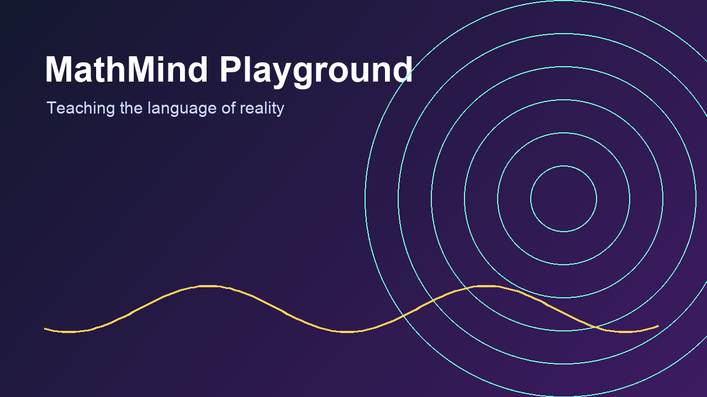
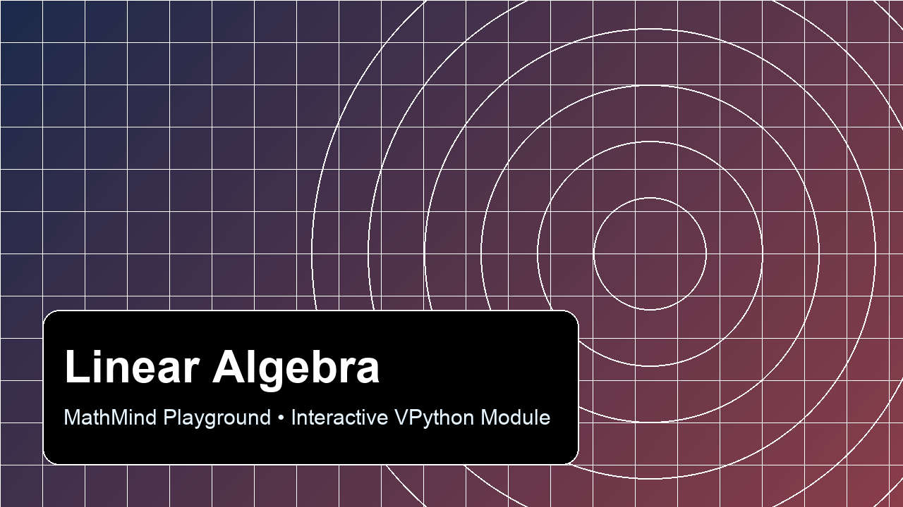
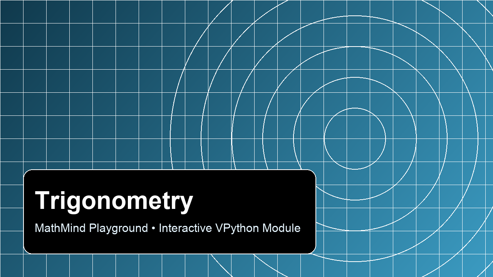
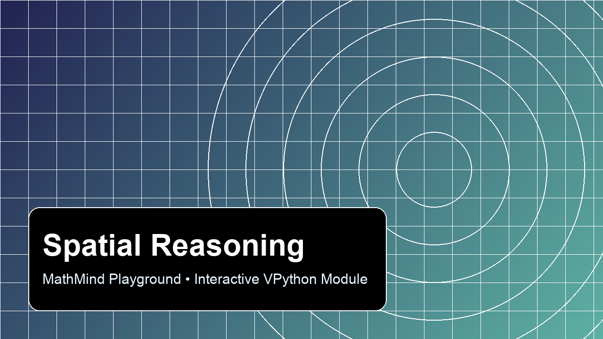
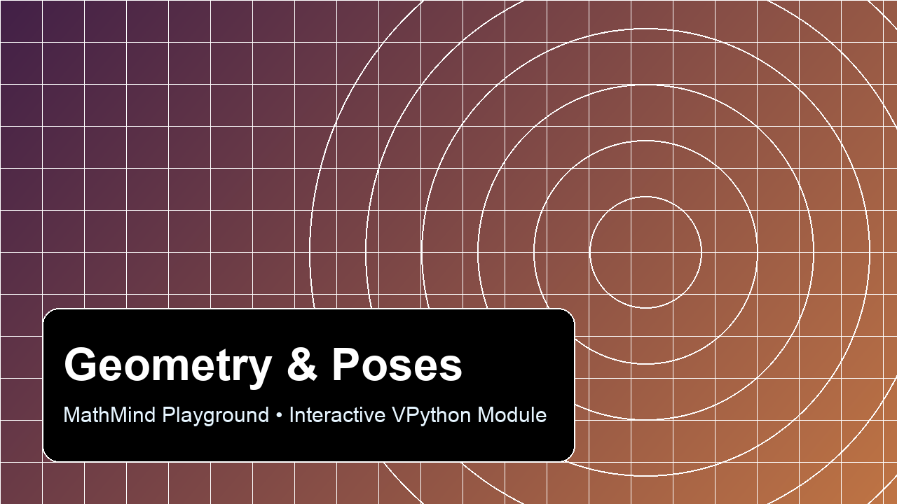
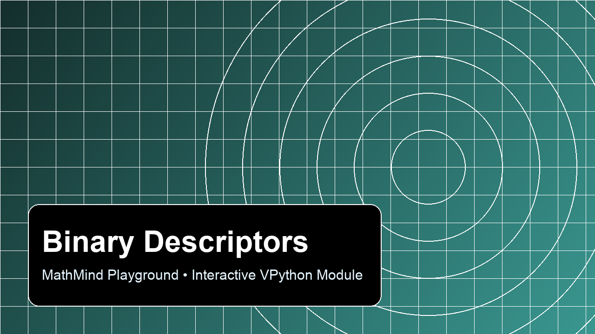
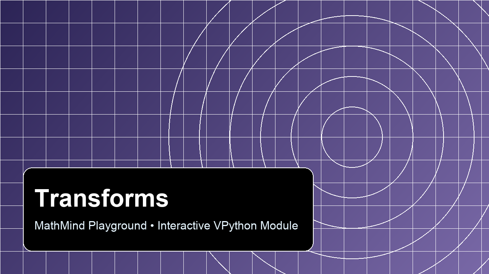
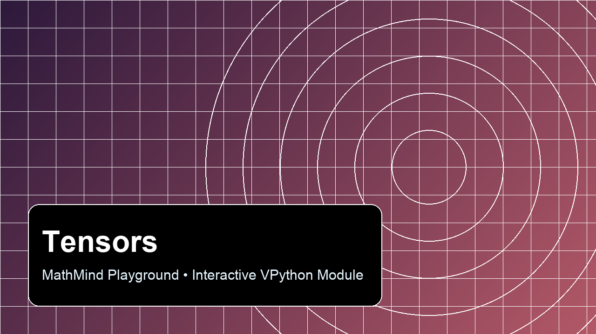
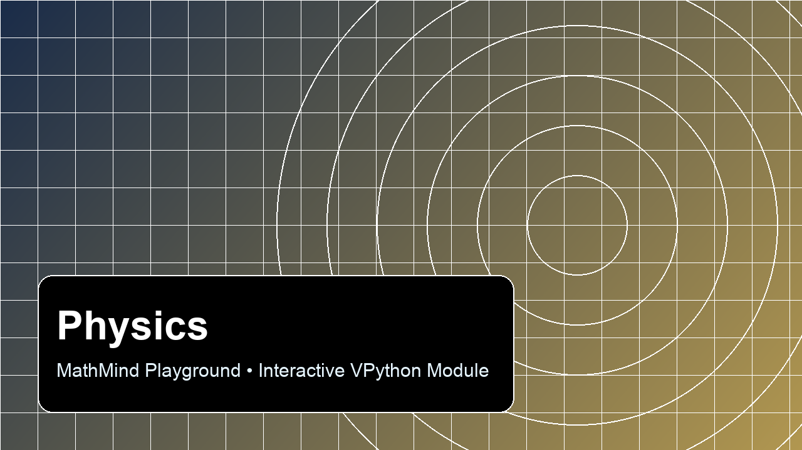

# MathMind Playground 🧠✨

> *Teaching the fundamental structures of thought, to ourselves and our descendants.*

[](https://www.python.org/downloads/)
[](https://vpython.org/)
[](LICENSE)

An interactive 3D playground for mathematical intuition. Built with VPython, designed for hacking.

<p align="center">
  
</p>

---

## Why this exists

Most math education asks you to trust symbols first and intuition later.

This project flips that.
You manipulate vectors, rotate frames, tune physical systems, and watch the math respond in real time.

This is math as engineering candy.

---

## The Eight Realms

<table>
  <tr>
    <td align="center"><b>1) Linear Algebra</b><br/><br/>draggable vectors, sums, span grid</td>
    <td align="center"><b>2) Trigonometry</b><br/><br/>unit circle, sin/cos, wave linkage</td>
  </tr>
  <tr>
    <td align="center"><b>3) Spatial Reasoning</b><br/><br/>3D heading, dot product, angle</td>
    <td align="center"><b>4) Geometry &amp; Poses</b><br/><br/>translation + yaw/pitch/roll</td>
  </tr>
  <tr>
    <td align="center"><b>5) Binary Descriptors</b><br/><br/>bit rings, rotation/noise, Hamming distance</td>
    <td align="center"><b>6) Transforms</b><br/><br/>local-to-world frame conversion</td>
  </tr>
  <tr>
    <td align="center"><b>7) Tensors</b><br/><br/>tensor action + quadratic form</td>
    <td align="center"><b>8) Physics</b><br/><br/>mass-spring-damper, forces, energy</td>
  </tr>
</table>

---

## Quickstart

```bash
git clone https://github.com/jclosure/mathmind-playground.git
cd mathmind-playground

python3 -m venv .venv
source .venv/bin/activate
pip install -r requirements.txt

python3 -m src.launcher
```

Or run any module directly:

```bash
python3 src/trigonometry.py
python3 src/physics.py
```

---

## Hackability

Every module includes a clearly marked `# 🔧 ADJUST THIS` section near the top.

Change constants, rerun, and observe the system immediately.

Good first tweaks:
- `ANGULAR_SPEED` in `trigonometry.py`
- `DAMPING_C` in `physics.py`
- `TENSOR_INIT` in `tensors.py`
- `POINT_LOCAL` in `transforms.py`

---

## Current Scope

Implemented and runnable now:
- `src/linear_algebra.py`
- `src/trigonometry.py`
- `src/spatial_reasoning.py`
- `src/geometry_poses.py`
- `src/binary_descriptors.py`
- `src/transforms.py`
- `src/tensors.py`
- `src/physics.py`
- `src/launcher.py`

---

## Philosophy

Linear algebra is how structure speaks.
Trigonometry is how cycles speak.
Geometry is how form speaks.
Transforms are how relationships speak.
Physics is how change speaks.

The goal is not to memorize formulas.
The goal is to *feel* the machinery of thought.

---

## Requirements

- Python 3.9+
- modern browser (VPython renders there)
- WebGL-capable graphics

---

## License

MIT
